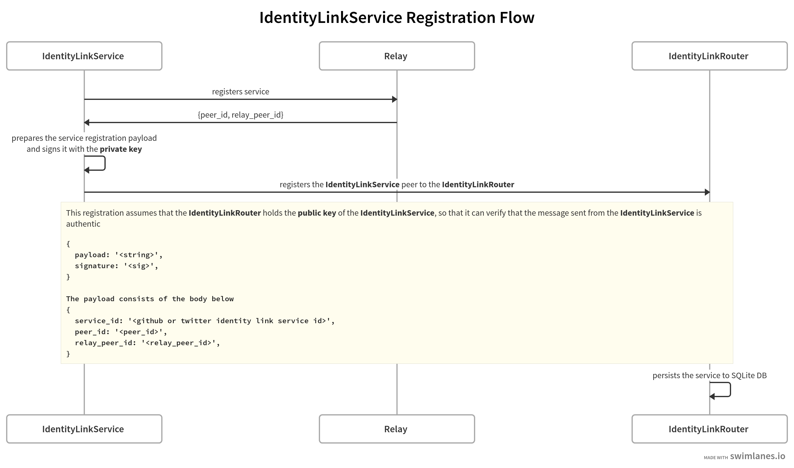
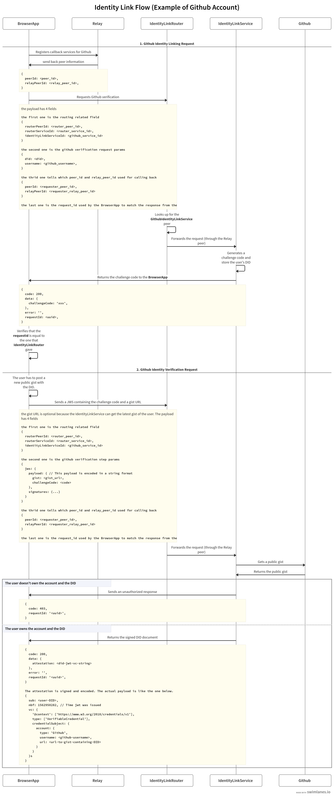

# IdentityLink API
The IdentityLink service helps users to associate their social accounts to Decentralized Identifiers (DID). This project is part of the Sovereign Data Hackathon https://gitcoin.co/issue/fluencelabs/sovereign-data-hackathon/2/100026739, and some of the logic code is orignated from https://github.com/ceramicstudio/identitylink-services.

This project aims to show that the identity link service API can be implemented in Peer-to-Peer protocol controlled by the Aqua language [https://doc.fluence.dev/aqua-book/] which is powered by Fluence [https://fluence.network/]

For more information of how full identity linking flow works, please visit https://github.com/ceramicstudio/identitylink-services/blob/master/API.md.

## Overview
This project consists of main 2 services and 1 web app.
- **IdentityLinkService**: is the main service taking care of account verification and all of the stuffs. It is implemented in NodeJS and connected to one of Fluence nodes via a relay server. This service has 2 sub-services which are the twitter identity link service and the github identity link service.
- **IdentityLinkRouter**: is the service for routing users' requests to the correct service destination (IdentityLinkService: twitter, github). It is implemented in Rust using Marine SDK and compiled into WASM to run in one of Fluence nodes in Marine VM.
- **WebApplication**: is a demo site for this service. Users can create their DIDs by using the Ethereum blockchain is a provider (connected through Metamask), and connect theirs DIDs to their social accounts (only Github and Twitter are currently supported). This application also has its services used by the IdentityLinkService to send back results.

## Implementation Details
Let's start with the basic questions before going to the flows.

### Why can't the WebApplication connect to the IdentityLinkService directly? What is the need of IdentityLinkService?
Since the IdentityLinkService is connected to the relay node it's peer_id and relay_peer_id can be changed if the service restarts (redeploy, error, etc.). The WebApplication must somehow find the new peer_id and relay_peer_id. This is why we need the IdentityLinkRouter.

### Why can't we implement the IdentityLinkService in Rust, so that it can be deployed in one of Fluence Nodes and have static service_id, and peer_id?
Because we could not find a proper way to store some of our credentials, e.g., Twitter's API keys, Github's personal access token, securely in the public node. If we store it in our service it would be safer for us.

### How does the IdentityLinkRouter know where the IdentityLinkService is?
We have the IdentityLinkService send a heartbeat to the IdentityLinkRouter. The heartbeat is comprised of its service_id, peer_id, relay_peer_id.

### Can someone else send the heartbeat to the IdentityLinkRouter and fake that it is the real IdentityLinkService?
No, it can't. We bundled the public key in the IdentityLinkRouter, and put the private key in the IdentityLinkService. Every time it has to send the heartbeat, it will sign a paylaod and attached the signature to the request. In this way, the IdentityLinkRouter can verify the signature and store this as a record in SQLite DB.

### So, does it mean someone can modify the SQLite DB store in the IdentityLinkRouter?
Yes, we don't have to enough time to fix this issue. However we can store the signature with the payload, so that it cannot be modified by other services running in the same node.

### Service Registration Flow
<p width="100%">

</p>

### Identity Link Flow (Example of Github Account)
Since Fluence aquamarine ecosystem still does not support Promise with FluenceJS we have to implement the flows by using the callback approach. After getting the request the IdentityLinkService will send back the result to the callback services implemented in the WebApplication.
<p width="100%">

</p>

### Note
There is a missing flow. The flow of validating a verifiable credential which need to implement a service for serving .well-known/did.json, and if we want it to verify via P2P we have to implement a new DID resolver but we don't have enough effort now.

## Running up this project
This project has to be run in-order as described below.

### 1.Preparation
- Set up the environment by following the steps in this https://doc.fluence.dev/docs/tutorials_tutorials/recipes_setting_up
- Make sure that you have openssl, Rust, and NodeJS **(version >= 14)** installed
- Redis is needed in case you don't use docker-compose.yaml for identity-link-service

### 2.Generate key pairs (**only need to run once**)
- This will generate private/public keys in various formats and they are copied to identity-link-service and identity-link-router
```
$ scripts
$ ./gen-keypairs.sh
```

### 3.Build identity-link-router
- go to the service directory and run the build script
```shell
$ cd services/identity-link-router
$ ./build.sh
```

### 4.Deploy identity-link-router
- after deployment, there will be identity-link-router.json which contains the peer_id and service_id of the IdentityLinkRouter used by WebApplication and IdentityLinkService.
- go to the service directory and run the build script
```shell
$ cd services/identity-link-router
$ ./deploy.sh
```

### 5.Run identity-link-service
1. the identity-link-router needs to be deployed first to make the identity-link-service fully functions
2. create services/identity-link-service/.env file (use .env.example as a reference) 
3. fill other variables in identity-link-service/.env

In case you don't have Redis, you can run Redis service in docker-compose.yaml (if the `npm run start` fails, try running it again)
```
$ cd services/identity-link-service
$ docker-compose up -d redis
$ npm ci
$ npm run start
```

Or you can simple run all of it in Docker
```
$ cd services/identity-link-service
$ docker-compose up
```

### 6.Run application client
1. create client/.env file (use .env.example as a reference)
```
$ cd client
$ npm ci
$ npm run start
```
